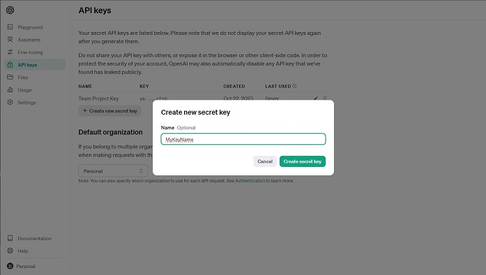
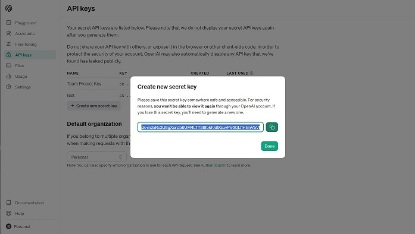
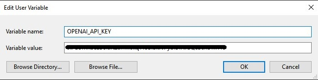

> # `Redder User Guide`
>
> Redder is a simple python application which allows users to easily scrape and save data from reddit to their local system.
>
> Redder currently has 3 modes of operation for the user to choose from depending on their situation.
>
> Read through the user guide and find what works best for you.
>
> ## `Project 1`
>
>> ### `Operation 1 - Scrape Post`
>>
>> **The first use case for Redder is when you would like to scrape data from a specific reddit post.**
>>
>> Redder uses the `post` argument of the format `-p` or `--post` for this operation.
>>
>> This argument takes in a url of the desired reddit post.
>>
>> Example of this arguments use:
>>
>> ```
>> python rdr.py -p https://www.reddit.com/r/desired_subreddit/comments/post_id#/post_title/
>> ```
>>
>> The data scraped using this operation will contain information regarding the post and the comments associated with.
>>
>> This operation will produce a file in the local application path subfolder in `redder\CS325_p3\Data\raw\`
>>
>> This new file will be titled `post-id#.json` in the local path `redder\CS325_p3\Data\raw\`, where id# is the internal unique ID of the post.
>>
>
> ## `Project 2`
>
>> ### `Operation 2 - Retrieve Post Comments`
>>
>> **The second use case for Redder is when you would like to get comments from a previously scraped reddit post using Operation 1.**
>>
>> Redder uses the `comments` argument of the format `-c` or `--comments` for this operation.
>>
>> This argument takes in a filename of the desired file located in the local app directory `redder\CS325_p3\Data\raw\`
>> 
>> The filename should be of the format `post-id#.json`, a file which is has been output using operation 1 in Project 1.
>>
>> Example of this arguments use:
>>
>> ```
>> python rdr.py -c post-id#.json
>> ```
>>
>> This operation method will retrieve the post data from the file and save the associated comments into a new .txt file.
>>
>> This operation will produce a file in the local application path subfolder in `redder\CS325_p3\Data\processed\`
>>
>> This new file will be titled `post-id#-comments.txt`, where id# is the internal unique ID of the post.
>>
>
> ## `Project 3`
>
>> The main functional component of Redder, `rdr.py` has been moved inside the `redder\CS325_p3\` folder located inside the main repository directory
>>
>> The Output Location(s) have been Moved To Their Respective Folder inside the `redder\CS325_p3\Data\` Subfolder of `redder\CS325_p3\`
>
> ## `Project 4 - Grant Doolin & Gautam Aneja`
>
>> ### `Operation 3 - Analyze Sentiments of Comments`
>>
>> **The third use case of redder is the ability to analyze the sentiments of the comments previously extracted using Operation 2.**
>> 
>> To do this, Redder utilizes `OpenAI's API` to leverage the `GPT-3.5-turbo` model to analyze the comments and return their sentiments.
>>
>>> *Before using this method, be sure you have a valid and active OpenAI account, and have properly set up your account's API key for redder. If not, follow the OpenAI setup guide further down.*
>>
>> Redder uses the `sentiments` argument  of the format `-s` or `--sentiments` for this operation.
>>
>> The argument takes in the filename of the desired file located in the local app directory `redder\CS325_p3\Data\processed\`
>>
>> This filename should be of the format `post-id#-comments.txt`, a file which has been output using Operation 2 in Project 2.
>>
>> Example of this arguments use:
>>
>> ```
>> python rdr.py -s post-id#-comments.txt
>> ```
>>
>> This argument will produce a CSV file titled `post-id#-comments-sentiments.txt` in the local app path `redder\CS325_p3\Data\Sentiments\`
>>
>> The CSV format inside of this new file will be like so: "sentiment","Text Analyzed"
>> 
>> The file will contain only 50 comments (**As noted in the project 4 outline**) that have been analyzed as to avoid wasting API tokens.
> 
> ## `Redder OpenAI API Setup Guide`
>
>> In order to use the features of Redder which are enabled by OpenAI's API, please follow these steps to ensure correct app execution.
>>
>> 1. First create an OpenAI account at: https://platform.openai.com/ and log in. (If this is your first account you should be given $5.00 in free credit to use the API, If not see OpenAI's fees for more information.) The API costs money to use, so this account must have a monetary 'balance' on it to proceed with using it.
>>
>> 2. Once logged in, navigate to the left side of the page in the nav bar and select the 'API Keys' tab:
>>
>> 
>> 
>> 3. On the API Keys page, select the Button 'Create new secret key' and give the key a name, then click the 'Create secret key' to confirm.
>>
>> 
>>
>> 4. After clicking 'Create secret key', the website will return your new secret key. Copy this key now and save it somewhere safe, you will not be able to recover it once you move forward.
>>
>>  
>>
>> 5. The last step is to actually use the key to call the API and this can be done a few different ways but I will show two ways below. `For redder, please use the 1st method below.`
>>
>> ## `Using OpenAI API Key`
>>
>> Before proceding with writing python code, make sure you have installed the necessary `openai` python package:
>>
>> ```
>> pip install openai
>> ```
>>
>>> ### `Method #1 - '.env' File`
>>>
>>> To quickly and easily use your key without system variables, you can use a file to store your key instead.
>>>
>>> This is done by creating a new file in the local directory of the target python application called `.env`
>>>
>>> Redder uses this method natively so the `.env` file already exists and is waiting for you at the local app path `redder\CS325_p3\`
>>>
>>> Inside of this file named `.env`, simply use the following line at the top and then save and close it:
>>>
>>> ```
>>> OPENAI_API_KEY=YourOpenAIAPIKeyGoesHere
>>> ```
>>>
>>> Once the key has been added to the file, the key is ready to be used.
>>>
>>> To use the key in python, we can simply `import openai` and then call the function `OpenAI()` and assign it to a variable instance we can use to make requests from:
>>>
>>> ```
>>> import openai
>>>
>>> clientAI = openai.OpenAI()
>>> ```
>>>
>>> Calling `OpenAI()` will look in the local directory for the `.env` file we made earlier and use the `OPENAI_API_KEY` value found in it.
>>>
>>> If the `.env` file and key were added properly, the function will return an openai instance we can use to make requests from like so:
>>>
>>> ```
>>> response = clientAI.chat.completions.create(
>>>     model="gpt-3.5-turbo",
>>>     messages=[
>>>         {"role": "system", "content": "You will be provided with a comment, and your task is to classify its sentiment, your response must be: 'positive', 'neutral', or 'negative'"},
>>>         {"role": "user", "content": "This is so cool, I love it!"}
>>>     ]
>>> )
>>> ```
>>
>>> ### `Method #2 - Environment Variables`
>>>
>>> To safely use your new key you should add the key to your systems environment variables.
>>>
>>> To do this, navigate to your operating systems environment variables (this will depend on your Operating System so use look it up).
>>>
>>> Once there, Add the new Environment User Variable like so:
>>>
>>> ```
>>> Variable name: OPENAI_API_KEY
>>>
>>> Variable value: YourOpenAIAPIKeyGoesHere
>>> ```
>>> 
>>>
>>> Once the variable has been added successfully, you can now use the key in python.
>>>
>>> To assign your key in python for the API, `import openai` and `os`, then just get the OS environment variable and assign it to the API's api_key instance for future API requests.
>>>
>>> ```
>>> import openai
>>> import os
>>>
>>> openai.api_key = os.environ["OPENAI_API_KEY"]
>>> ```
>>>
>>> If everything was done properly, you can now make requests using the OpenAI API like so:
>>>
>>> ```
>>> response = openai.chat.completions.create(
>>>     model="gpt-3.5-turbo",
>>>     messages=[
>>>         {"role": "system", "content": "You will be provided with a comment, and your task is to classify its sentiment, your response must be: 'positive', 'neutral', or 'negative'"},
>>>         {"role": "user", "content": "This is so cool, I love it!"}
>>>     ]
>>> )
>>> ```
>>
>